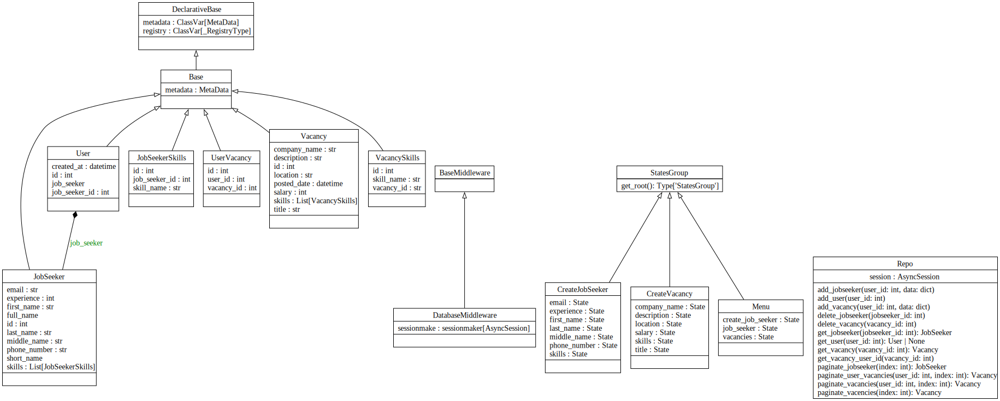

### Пояснювальна записка

#### до курсової роботи з навчальної дисципліни «Прикладне програмування»

#### на тему «Telegram бот для пошуку роботи та вакансій»

---

#### Виконав:
ст. гр. КН-206

#### Перевірив:
проф. каф. САП

---

## Розділ 1. Проблемна ситуація та зацікавлені сторони

### 1.1. Опис проблемної ситуації

**Об'єкт:** Користувачі, які шукають роботу, та роботодавці, які шукають кандидатів.

**Суб'єкт:** Відсутність єдиної платформи в Telegram для зручного пошуку роботи та вакансій.

**Об'єктивна сторона:** Багато кандидатів та роботодавців використовують Telegram для комунікації, але їм бракує спеціалізованого інструменту для ефективного пошуку роботи та кандидатів. Відсутність такої платформи призводить до розпорошеності інформації та збільшення часу на пошук.

**Суб'єктивна сторона:** Зростаюча популярність Telegram як комунікаційного засобу створює попит на інтеграцію функціоналу пошуку роботи та вакансій саме в цьому середовищі.

### 1.2. Аналіз зацікавлених сторін

**Кандидати:** Шукають зручний спосіб створити профіль та знаходити вакансії.

**Роботодавці:** Шукають зручний інструмент для розміщення вакансій та перегляду кандидатів.

**Розробники:** Зацікавлені в створенні популярного інструменту, який зможе залучити широку аудиторію користувачів Telegram.

### 1.3. SWOT-аналіз проблемної ситуації

**Сильні сторони:**
- Широка аудиторія користувачів Telegram.
- Легкість використання чат-бота.

**Слабкі сторони:**
- Обмежена функціональність у порівнянні з веб-платформами.
- Залежність від стабільності роботи Telegram API.

**Можливості:**
- Залучення великої кількості користувачів.
- Можливість інтеграції з іншими сервісами Telegram.

**Загрози:**
- Конкуренція з іншими платформами для пошуку роботи.
- Потенційні зміни в політиці використання Telegram API.

## Розділ 2. Мета та завдання проекту

### 2.1. Перелік проблем

1. Відсутність централізованої платформи для пошуку роботи в Telegram.
2. Складність в управлінні вакансіями та профілями кандидатів.
3. Відсутність можливості швидко знайти відповідні вакансії або кандидатів.

### 2.2. Дерево проблем

1. Відсутність централізованої платформи
   - Розпорошеність інформації
   - Труднощі в комунікації

2. Складність в управлінні вакансіями
   - Необхідність ручного відстеження
   - Відсутність автоматизації процесів

3. Відсутність можливості швидкого пошуку
   - Затримки в процесі пошуку
   - Незручність використання інших платформ

### 2.3. Перелік цілей

1. Створення централізованої платформи для пошуку роботи в Telegram.
2. Спрощення управління вакансіями та профілями кандидатів.
3. Забезпечення швидкого та зручного пошуку вакансій і кандидатів.

### 2.4. Дерево цілей

1. Створення централізованої платформи
   - Інтеграція з Telegram API
   - Розробка зручного інтерфейсу користувача

2. Спрощення управління вакансіями
   - Автоматизація процесів
   - Забезпечення зручного доступу до інформації

3. Забезпечення швидкого пошуку
   - Оптимізація алгоритмів пошуку
   - Інтеграція з базою даних

### 2.5. Логічна матриця

| Загальна ціль             | Індикатор прогресу       | Як індикатор буде виміряно               |
|---------------------------|--------------------------|------------------------------------------|
| Створення централізованої платформи | Кількість активних користувачів | Різницею між кількістю нових користувачів і кількістю користувачів, що покинули платформу за певний період |

| Конкретна ціль            | Індикатор прогресу       | Як індикатор буде виміряно               | Припущення та ризики                         |
|---------------------------|--------------------------|------------------------------------------|---------------------------------------------|
| Автоматизація процесів    | Час на управління вакансіями | Зменшення середнього часу на створення та редагування вакансій | Залежність від стабільності Telegram API     |
| Оптимізація алгоритмів пошуку | Час на пошук вакансій     | Скорочення середнього часу на пошук вакансії | Можливі зміни в політиці використання API Telegram |

## Розділ 3. UML-діаграма

(У діаграмі наведено основні класи та їх взаємодію у системі Telegram бота)

## Розділ 4. Реалізація

### 4.1. Програма мовою Python

Реалізація програми здійснюється за допомогою бібліотеки aiogram для інтеграції з Telegram Bot API та SQLAlchemy для роботи з базою даних. Основні компоненти включають моделі даних, обробники команд та повідомлень, а також функції для форматування та відображення інформації.

### 4.2. Інструкція користувача

Інструкція містить детальні кроки щодо використання основних функцій бота, таких як реєстрація, створення профілю кандидата, пошук вакансій, створення вакансій та управління ними.

## Розділ 5. Самоаналіз роботи

Проект надає зручний інструмент для пошуку роботи та найму кандидатів, об'єднуючи роботодавців і шукачів роботи в одному місці. Основні функції забезпечують реєстрацію користувачів, створення профілів, пошук та управління вакансіями, що робить процес пошуку роботи та кандидатів більш ефективним.

---

## Висновок

Telegram бот для пошуку роботи та вакансій значно спрощує процес комунікації між кандидатами та роботодавцями, забезпечуючи зручний та швидкий доступ до необхідної інформації. Інтеграція з Telegram робить цей інструмент доступним для широкої аудиторії, а автоматизація процесів зменшує час на виконання основних задач.
